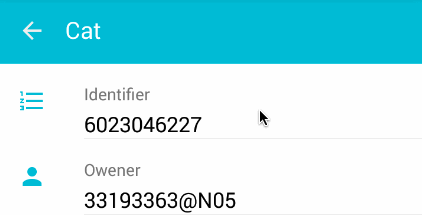
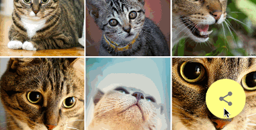
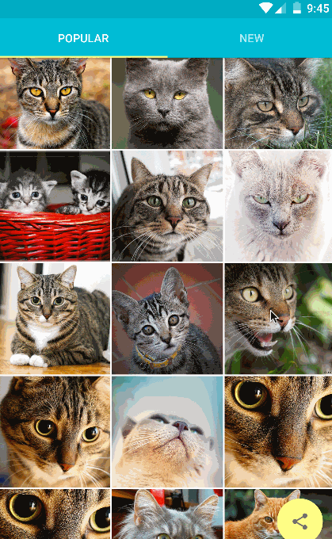

# Material Cat
Cat photos app for Material Design Animation tranining.

<a href="https://play.google.com/store/apps/details?id=com.konifar.materialcat">
  
</a>

# Material Animations
## Ripple Effect
* [Responsive interaction](https://www.google.com/design/spec/animation/responsive-interaction.html#responsive-interaction-user-input) in Material Design Spec.
* [Customize Touch Feedback](http://developer.android.com/training/material/animations.html#Touch) in Developer page.



## Reveal Animation
* [Meaningful Transitions](https://www.google.com/design/spec/animation/meaningful-transitions.html) in Material Design Spec.
* [Use the Reveal Effect](http://developer.android.com/training/material/animations.html#Reveal) in Developer page.



## Activity Transition (Shared Element)
* [Meaningful Transitions](https://www.google.com/design/spec/animation/meaningful-transitions.html) in Material Design Spec.
* [Customize Activity Transitions](http://developer.android.com/training/material/animations.html#Transitions) in Developer page.



## Animated Vector Drawable
* [Delightful details](https://www.google.com/design/spec/animation/delightful-details.html) in Material Design Spec.
* [Animate Vector Drawables](http://developer.android.com/training/material/animations.html#AnimVector) in Developer page.


# Thanks
This app uses following Material design support libraries for pre-lollipop.
* [CircularReveal](https://github.com/ozodrukh/CircularReveal)
* [NineOldAndroids](https://github.com/JakeWharton/NineOldAndroids)
* [materialish-progress](https://github.com/pnikosis/materialish-progress)
* [fab-transformation](https://github.com/konifar/fab-transformation)

# Developed By
Yusuke Konishi (konifar) - <yahpeycoy0403@gmail.com>

Twitter Account [@konifar](http://twitter.com/konifar)

# License
```
The MIT License (MIT)

Copyright (c) 2015 Yusuke Konishi

Permission is hereby granted, free of charge, to any person obtaining a copy
of this software and associated documentation files (the "Software"), to deal
in the Software without restriction, including without limitation the rights
to use, copy, modify, merge, publish, distribute, sublicense, and/or sell
copies of the Software, and to permit persons to whom the Software is
furnished to do so, subject to the following conditions:

The above copyright notice and this permission notice shall be included in all
copies or substantial portions of the Software.

THE SOFTWARE IS PROVIDED "AS IS", WITHOUT WARRANTY OF ANY KIND, EXPRESS OR
IMPLIED, INCLUDING BUT NOT LIMITED TO THE WARRANTIES OF MERCHANTABILITY,
FITNESS FOR A PARTICULAR PURPOSE AND NONINFRINGEMENT. IN NO EVENT SHALL THE
AUTHORS OR COPYRIGHT HOLDERS BE LIABLE FOR ANY CLAIM, DAMAGES OR OTHER
LIABILITY, WHETHER IN AN ACTION OF CONTRACT, TORT OR OTHERWISE, ARISING FROM,
OUT OF OR IN CONNECTION WITH THE SOFTWARE OR THE USE OR OTHER DEALINGS IN THE
SOFTWARE.
```
